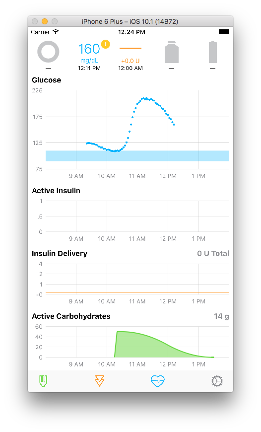

# HealthScenarios
Simple tool to populate HealthKit according to various scenarios, designed to help test other apps. 

This app overwrites existing HealthKit data with data from different sample scenarios. Initially designed to aid in development of [Loop](https://github.com/LoopKit/Loop) - currently only provides a single scenario that results in a Loop image like this:

